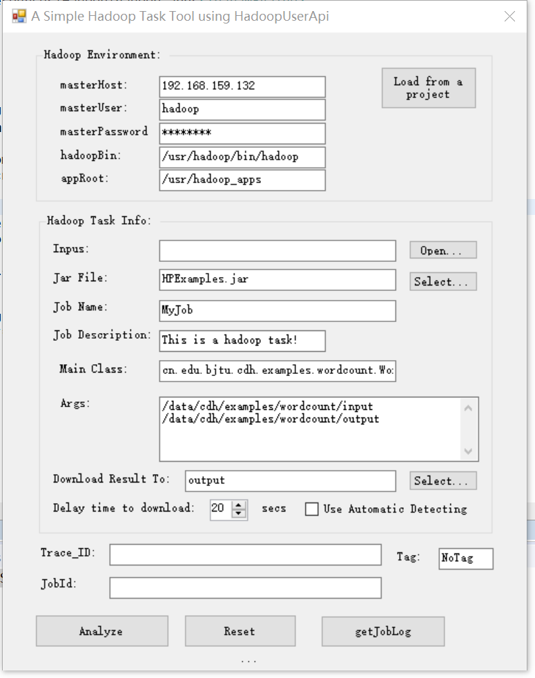

# SimpleHadoopTool

A simple tool to submit MapReduce jobs to Hadoop cluster

## HadoopUserApi

This project handles execution of APIs of Hadoop cluster in Java. 

## SimpleHadoopToolClient

This project in C# is user-friendly for users to submit a MapReduce task to Hadoop cluster. The task configuration can be imported from a Catla-HS task. The tool has to be used with the ```HadoopUserApi``` server side.

## Screenshot




